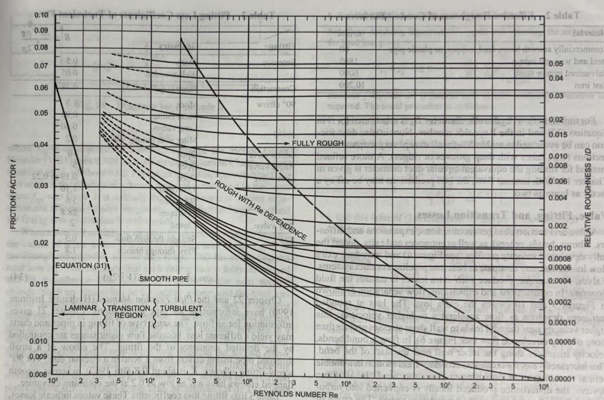
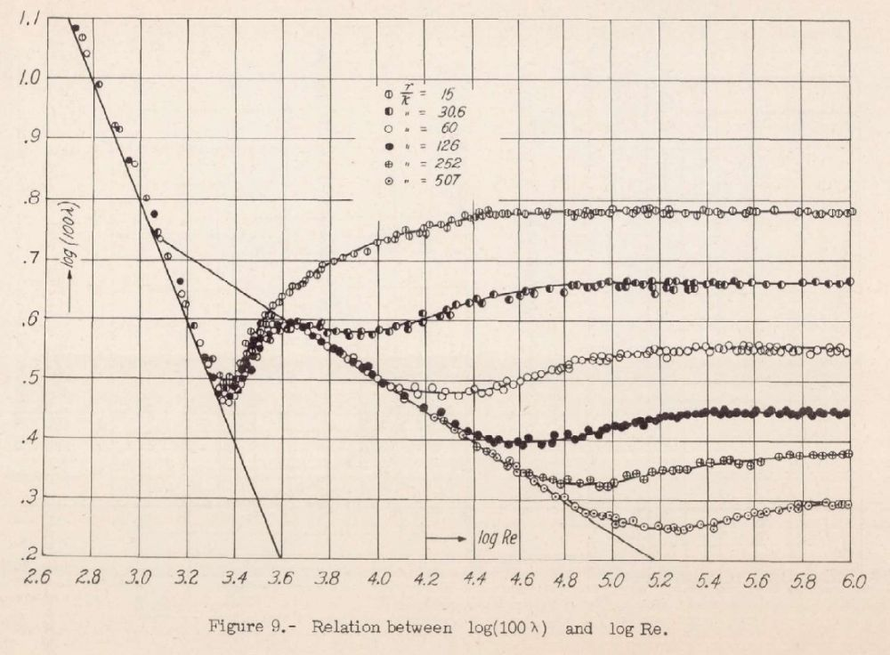

# HVAC Engineering Toolkit (Excel + Machine Learning)

*This is the technical companion to my [toolkit portfolio.](https://gomechra.com)*

## Introduction

This repository complements my project’s portfolio page by focusing on the **machine learning extension** of the provided friction calculators.
It provides enough context to stand on its own while remaining more concise than the full portfolio documentation.
The toolkit addresses the classic **Colebrook-White equation** for fluid-flow friction factor, using modern data-driven methods.

In traditional engineering practice, this equation is *implicit* and must be solved iteratively, an approach that becomes time-consuming for large or repeated calculations.
The well-known **Moody diagram**, compiled from thousands of experimental tests (including Nikuradse's pipe-flow experiments), has long been used to estimate friction factor graphically.
This project leverages **machine learning (ML)** to directly predict the **Darcy–Weisbach friction factor** directly from flow conditions, providing a fast, explicit, and highly accurate alternative to manual or iterative solutions.

## Project Overview and Scope

Within the **duct** and **pipe** modules, the toolkit predicts the **Darcy friction factor** from two key inputs: **Reynolds number (Re)** and **relative roughness (ε/D)**, the same parameters used in the Colebrook-White equation and Moody chart.

This repository provides:

- A **concise recap of the problem** and underlying methodology.
- A clear explanation of **why machine learning is valuable** in this context.
- Details on **how the training data** (digitized from the Moody chart and Nikuradse's experiments) was prepared.
- **Fully commented Python code** implementing an XGBoost regression model to learn the friction factor relationship.
- **Supplementary example code** illustrating the internal mechanics of gradient boosting for educational purposes.

## Why Use Machine Learning for the Colebrook Equation?

Using **machine learning (ML)** for this problem offers two main advantages:
1. Eliminates the need for iterative solutions.
2. Anchors predictions to real experimental data.

The **Colebrook–White equation** is implicit (the friction factor *f* appears on both sides), so it must be solved using iterative numerical methods or empirical approximations. In practice, each evaluation can require multiple computational steps, which become cumbersome when repeated across large systems or optimization routines.
An ML model, once trained, provides an **explicit predictive function; given *Re* and *ε/D*, it outputs *f* directly, with no iteration required.

Additionally, this approach is inherently **data-driven**. Instead of relying on a single empirical formula, an ML model can be trained on a broad set of known (Re, ε/D, f) points, capturing the nonlinear relationships across laminar, transitional, and turbulent regimes.

In this project, the model was trained on **digitized Moody and Nikuradse chart data**, grounding its predictions in real observed behavior. Because the method is flexible, the model can easily be **retrained or extended** as new data becomes available.

## Data Collection and Preparation

The first step was to assemble a dataset of known friction factor values by digitizing classical experimental results from **Moody (1944)** and **Nikuradse (1933)** charts using [WebPlotDigitizer.](https://automeris.io/) Digitizing both sources ensured consistency and overlap (particularly around values corresponding to *ε/D = 0.001*) while covering a broad range of **Reynolds numbers** and **relative roughness**.

The Moody data (*Figure 1 below*) provided smoother surface conditions, whereas the Nikuradse data (*Figure 2 below*) contributed higher roughness curves. Together, they form a robust, complementary dataset.

### Moody (1944) – Digitized Friction Factor Chart


*Figure 1. Moody (1944) – Classic friction factor diagram digitized for dataset creation.*

---

### Nikuradse (1933) – Sand-Roughened Pipe Flow Data


*Figure 2. Nikuradse (1933) – Experimental results used to establish roughness correlations and validate turbulent flow behavior.*

---

**Range of represented values:**

| **Source**     | **Reynolds Number (Re)** | **Friction Factor (f)** | **Relative Roughness (ε/D)** |
|------------|-----------------------|---------------------|---------------------------|
| Nikuradse  | 550 – 1.2 × 10⁶       | 0.0189 – 0.143      | 0.0010 – 0.0333           |
| Moody      | 3.1 × 10³ – 9.9 × 10⁷ | 0.008 – 0.045       | 0.00001 – 0.0010          |

The combined dataset was compiled into a single CSV file with columns for **Re**, **ε/D**, and **friction factor (f)**.
For demonstration purposes, this repository references a placeholder file named *digitized_data.csv*. The actual dataset is integrated directly into the private version of the toolkit and is **not distributed** as a standalone file.

## Model Selection: XGBoost Regression

I selected XGBoost (Extreme Gradient Boosting) as the regression algorithm for this model due to its strong performance on structured, tabular datasets.
XGBoost is an open-source library that implements an optimized form of **gradient-boosted decision trees**.
In gradient boosting, an ensemble of shallow *weak learners* (decision trees) is built sequentially, each new tree correcting the residual errors of the previous ones.
This process effectively minimizes the overall prediction error over many boosting rounds.

XGBoost’s implementation is known for being fast, parallelized, and regularized, which helps prevent overfitting while maintaining high accuracy.

For **friction factor prediction**, XGBoost offers several advantages:
- **Nonlinear function approximation:** The relationship between *f* and *(Re, ε/D)* is highly nonlinear, as shown by the curvature of the Moody chart. XGBoost models these complex patterns by combining many decision tree splits.
- **Speed and efficiency:** Despite using thousands of data points, XGBoost trains rapidly. Once trained, predictions are nearly instantaneous, ideal for engineering tools that perform repeated calculations.
- **Accuracy and tuning flexibility:** XGBoost provides tunable hyperparameters (e.g., tree depth, number of trees, learning rate) to balance accuracy and generalization. Even default settings yield reliable performance, but fine-tuning can push accuracy further.

In short, XGBoost serves as the **regression engine** that learns the mapping *f = F(Re, ε/D)*, transforming classical fluid dynamics relationships into a fast, data-driven model.

## XGBoost Model Implementation (Code Outline)

This repository includes a **fully commented Python script** that walks through the complete model development process, from reading the data to generating the final results. It's written to be **easy to follow**, even for readers new to machine learning.

Below is the step-by-step outline:

1. **Import Libraries**

   The script begins by importing Python's core scientific stack:
   - pandas for data handling
   - numpy for numerical operations
   - xgboost (and scikit-learn utilities) for regression modeling and evaluation

```python
# Core libraries
import pandas as pd
import numpy as np

# Model & utilities
from xgboost import XGBRegressor
from sklearn.model_selection import train_test_split
from sklearn.metrics import mean_squared_error, r2_score, mean_absolute error

# Reproducibility for splits / models where applicable
RANDOM_STATE = 42
```

2. **Load the Dataset**

   Read the CSV file of digitized points into a pandas DataFrame.
   Display a few rows using df.head() to verify that the data loaded correctly and that the columns (Re, ε/D, f) appear as     expected.
   For this example, a placeholder file *digitized_data.csv* is used to simulate the original dataset.

```python
data = pd.read_csv('digitized_data.csv')
data.head()
```

3. **Feature Engineering and Data Splitting**

   Prepare the **input features** and **target variable**:
   
```python
X = data[['Re', 'epsilon_D']]
y = data['f']
```

   Next, split the dataset into **training** and **testing** sets using an 80/20 ratio. This ensures the model is evaluated on unseen data, providing a fair measure of performance. 

```python
X_train, X_test, y_train, y_test = train_test_split(X, y, test_size=0.2, random_state=42)
```

   Using train_test_split fron sklearn-learn maintains reproducibility and helps prevent overfitting by keeping a portion of the data strictly for validation.
   
4. **Training the XGBoost Regressor:** Initialize an XGBoost regressor (for example, using XGBRegressor from xgboost.sklearn module) with some default or tuned hyperparameters:

```python
model = XGBRegressor(n_estimators=200, max_depth=5, learning_rate=0.1, random_state=42)
model.fit(X_train, y_train)
```

The following explains each parameter: n_estimators is the number of trees, max_depth controls how complex each tree can be, and learning_rate scales the contribution of each new tree (preventing overfitting by making training more gradual).

5. **Model Evaluation:** After training, check how well the model learned the data. The code computes predictions on the held-out test set:

```python
y_pred = model.predict(X_test)
rmse = mean_squared_error(y_test, y_pred, squared=False)
r2 = r2_score(y_test, y_pred)
```

Measure error using metrics like Mean Absolute Error (MAE) or Root Mean Square Error (RMSE). This gives an idea of whether the model is within the ±5% range for most points, for example. The results (printed to console) will demonstrate if the model is sufficiently accurate. If not, iterate on hyperparameters or data.

6. **Generating the Lookup Table:** Produce a lookup table of friction factors that can be used directly without needing the machine learning code. Use the trained XGBoost model to predict friction factors on a grid of Re and roughness values. The script programmatically creates a fine grid, for example:

```python
re_min, re_max = data["Re"].min(), data["Re"].max()
eps_min, eps_max = data["epsilon_D"].min(), data["epsilon_D"].max()

n_Re = 200
n_eD = 200
re_grid = np.geomspace(re_min, re_max, num=n_Re)
eD_grid = np.geomspace(max(eD_min, 1e-8), eD_max, num=n_eD)
grid_points = np.column_stack([grid_re.ravel(), grid_eps.ravel()])

grid_pairs = np.array([(Re, eD) for Re in Re_grid for eD in eD_grid])
f_pred = model.predict(grid_pairs)

export_long = pd.DataFrame({
    "Re": np.repeat(Re_grid, n_eD),
    "eps_over_D": np.tile(eD_grid, n_Re),
    "f_pred": f_pred
})

wide = export_long.pivot(index="Re", columns="eps_over_D", values="f_pred")
wide = wide.sort_index(axis=0).sort_index(axis=1)
wide.to_csv("friction_lookup_table.csv")
```

Reshape or organize the output into a table or matrix form. Save this table to a CSV file.

7. **Results and Sample Usage:** Across non-error producing input bounds (realistic observable data), the machine learning model produced results consistent with the Churchill approximation witin 0.2 to 4.9%.

**CONTINUED HERE**

## Understanding XGBoost’s Internal Workings

To bridge the gap between **using** a machine learning library and **understanding** how it works, this section provides a second, simplified code example that illustrates the internal logic behind gradient boosting.
The goal is not to rebuild XGBoost entirely, but to show the **core learning process** it follows during training.

- **Gradient Boosting Concept**

  Gradient boosting starts with an initial prediction (for example, the mean friction factor of the training data). It then iteratively adds shallow decision trees that predict the residual error, which is the difference between the model's previous predictions and the true target values. Each new tree incrementally corrects the model's mistakes, gradually minimizing overall error.

- **Simplified Implementation**

  Instead of constructing full decision trees from scratch, the demonstration below uses basic tools to mimic the key ideas.
  The code shows how boosting can iteratively fit to residuals to improve prediction accuracy.

```python
from sklearn.tree import DecisionTreeRegressor

# Start with an initial prediction (e.g., mean of y)
initial_pred = y_train.mean()
y_pred_current = np.full(y_train.shape, initial_pred)
model_trees = []  # to store the sequence of trees
n_boost_rounds = 3  # for demonstration, build 3 trees sequentially

for i in range(n_boost_rounds):
    # Compute residuals (current errors)
    residuals = y_train - y_pred_current
    # Train a small decision tree on residuals
    tree = DecisionTreeRegressor(max_depth=3)
    tree.fit(X_train, residuals)
    model_trees.append(tree)
    # Update the current prediction by adding the new tree’s predictions
    y_pred_current += tree.predict(X_train)
```

   This loop mimics the gradient boosting process. Each tree learns to predict the residual error left by the previous model iteration.
   Over successive boosting rounds, these small corrective models collectively reduce error and improve prediction accuracy.
   In this demonstration, only a few boosting iterations are shown for clarity.
   After training, the variable model_trees holds the sequence of fitted trees that together form the final ensemble model, a simplified representation of how XGBoost builds its predictions.

- **Applying the Ensemble**

  Once the ensemble of trees has been trained, use it to **predict new values**.
  Each tree contributes a small correction to the overall  prediction, which begins with the model's initial baseline estimate (often the mean of the target values).
  For a given input pair *(Re, ε/D)*:
  
```python
def predict_ensemble(Re, rr):
    # Start with initial prediction
    pred = initial_pred
    for tree in model_trees:
        pred += tree.predict([[Re, rr]])[0]
    return pred

sample = X_test.iloc[0]
print("Ensemble prediction:", predict_ensemble(sample['Re'], sample['rel_roughness']))
print("Actual friction factor:", y_test.iloc[0])
```

   The above function accumulates the contributions from each weak learner, combining them with the initial prediction to form the final output.
   After running this simplified booster, the script prints a comparison between the **ensemble’s predictions** and the **true friction factor values** for a few test examples. This demonstrates how even a small number of boosting rounds can begin to capture the nonlinear relationship between flow parameters and friction factor.

## Summary and Next Steps

This repository demonstrates the machine learning workflow behind the toolkit’s friction factor prediction system.
It focuses on the XGBoost model, from data preparation and training to understanding the underlying gradient boosting process.
The example code, explanatory comments, and simplified boosting demonstration are designed to make the method transparent and reproducible.

The **toolkit itself** (Excel-based with integrated ML lookup functionality) is showcased separately on the [project portfolio site](https://gomechra.com), where you can explore the broader engineering context, interface design, and validation results.

This repository is intended as a technical companion to that portfolio, highlighting the model development, reasoning, and implementation details behind the data-driven approach.

## Contact

For questions, feedback, or collaboration inquiries:

Email: [info.help@gomechra.com](mailto:info.help@gomechra.com)

LinkedIn: [Connect on LinkedIn](https://www.linkedin.com/in/dominick-femia/)

Portfolio: [gomechra.com](https://gomechra.com)
